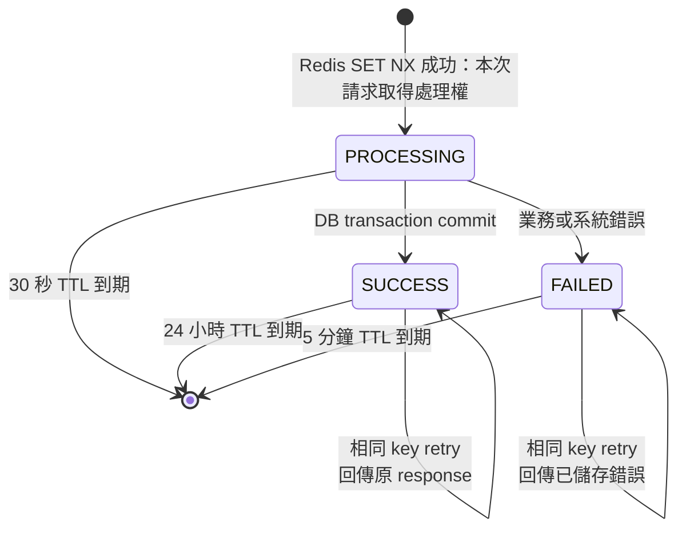

# Idempotency state and TTL

Idempotency record 的 Redis key 格式：

```text
idempotency:campaign:{campaignId}:user:{userId}:key:{idempotencyKey}
```



多個使用相同 idempotency key 的 request 同時競爭時，只有第一個成功在 Redis 建立 key 的 request 會建立 PROCESSING record 並取得處理權；其他 request 的 SET NX 會失敗。

## 狀態說明

| 狀態 | 內容 | TTL | 相同 key 再次請求 |
| --- | --- | --- | --- |
| `PROCESSING` | 請求正在執行 | 30 秒 | 回傳 `409 Conflict` |
| `SUCCESS` | 保存第一次成功 response | 24 小時 | 直接回傳原 response |
| `FAILED` | 保存 exception message | 5 分鐘 | 目前回傳 `409 Conflict` |

## 調試指令

不要在生產環境使用 `KEYS *`，因為它會掃描整個 keyspace。開發時可使用 SCAN：

```bash
redis-cli --scan --pattern 'idempotency:*'
redis-cli GET 'idempotency:campaign:1:user:1:key:test-001'
redis-cli TTL 'idempotency:campaign:1:user:1:key:test-001'
```

如果要確認 Spring 實際送出哪些 Redis 指令，可在開發環境短暫使用：

```bash
redis-cli MONITOR
```

## 目前已知語意<待改善！>

FAILED 目前只儲存 `exception.getMessage()`，沒有儲存原始 HTTP status 與穩定的 error code。因此第一次錯誤可能是 400，相同 key retry 卻會回傳 409。這是後續錯誤格式與 idempotency 設計可改善的地方。
