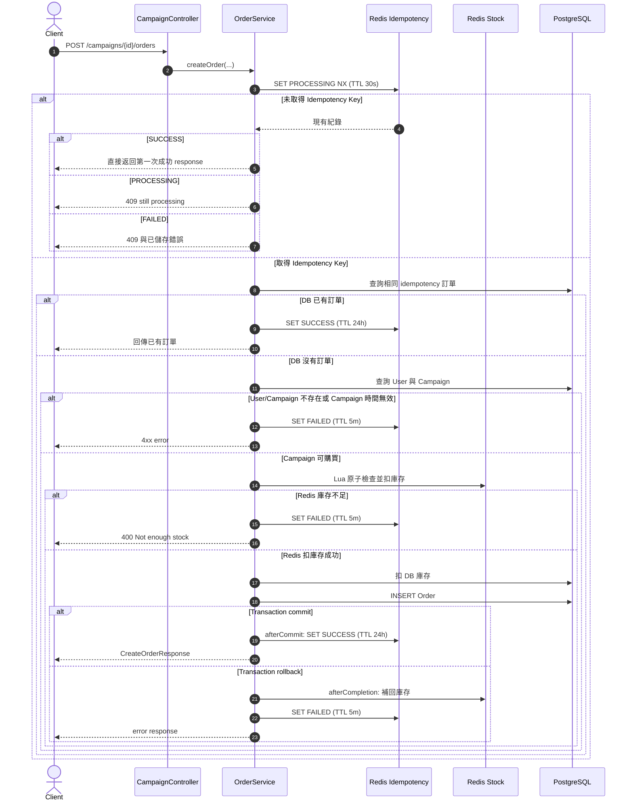

# Order creation sequence

這張圖說明 `POST /campaigns/{campaignId}/orders` 中，idempotency、Redis 庫存與 PostgreSQL transaction 的互動。

## 關鍵觀察

- Idempotency key 在查詢 User 和 Campaign 之前就會建立。
- Campaign 已結束時，PROCESSING 會被改寫為 FAILED，FAILED 只保留 5 分鐘。
- Redis 庫存先扣，PostgreSQL 後扣；後續失敗時必須由應用程式補回 Redis 庫存。
- `afterCommit` 只在 DB 確實 commit 後將 idempotency 標記為 SUCCESS。
