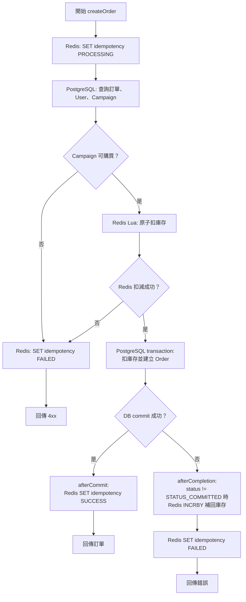

# Redis and PostgreSQL transaction boundary

`@Transactional` 只管理 PostgreSQL 操作。Redis 扣庫存、補庫存與 idempotency 狀態不會跟著 JPA transaction 自動 commit 或 rollback。

## 一致性邊界

| 操作 | 儲存系統 | 是否受 JPA rollback 保護 |
| --- | --- | --- |
| 扣 DB 庫存 | PostgreSQL | 是 |
| INSERT Order | PostgreSQL | 是 |
| 扣或補回即時庫存 | Redis | 否 |
| Idempotency 狀態 | Redis | 否 |

## 為什麼需要 callback

- `afterCommit` 避免 DB 最後 commit 失敗，Redis 卻已經對外宣告 SUCCESS。
- `afterCompletion` 會檢查 callback 收到的 transaction status；只有在 `status != TransactionSynchronization.STATUS_COMMITTED` 時，才會補回 Redis 庫存，並將 idempotency 標記為 FAILED。
- 這是應用層的補償機制，不是跨 Redis/PostgreSQL 的單一 ACID transaction。如果應用在補償前崩潰，仍可能留下不一致狀態，需要後續的 reconciliation 或事件機制改善。
